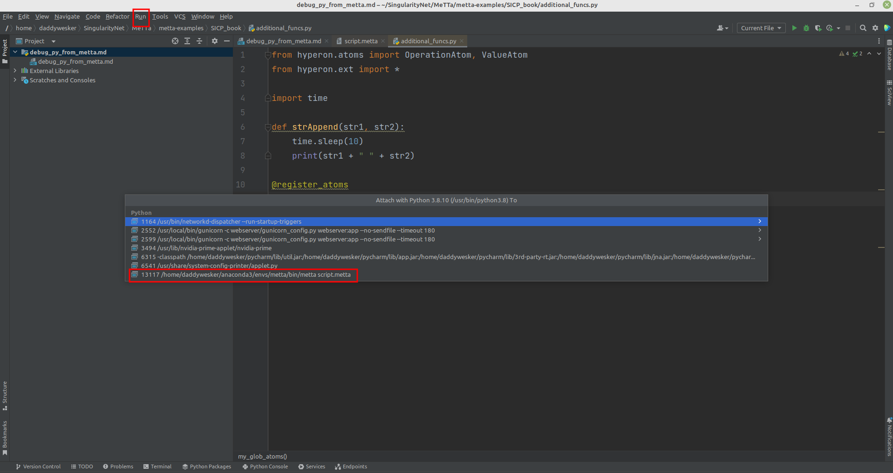
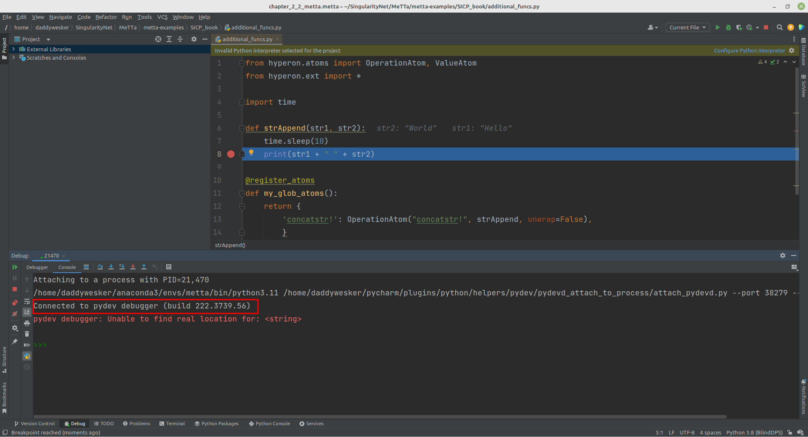
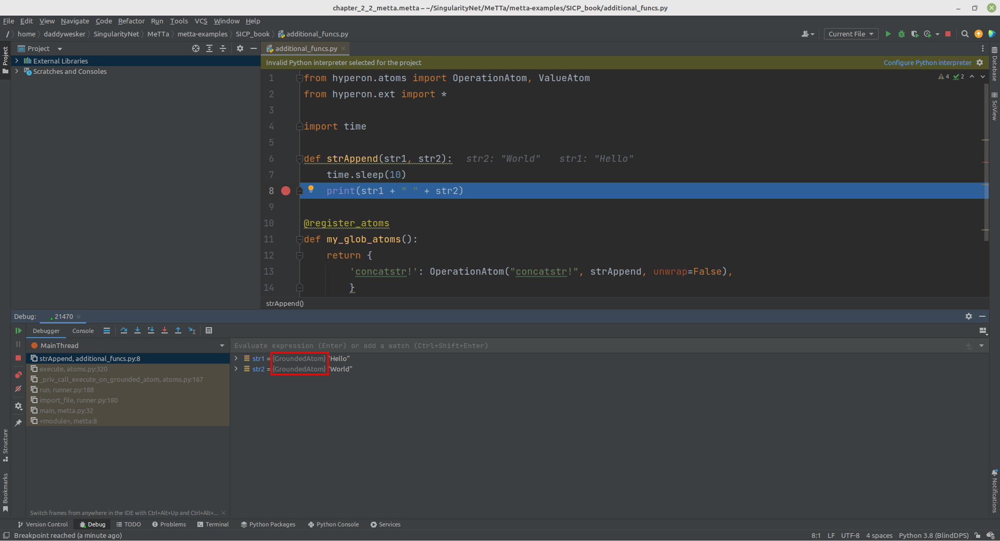
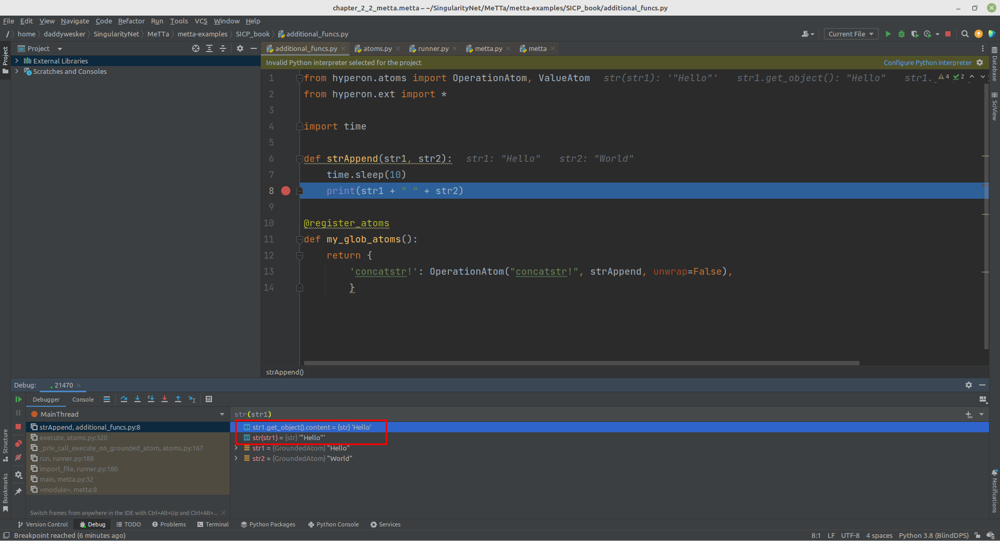
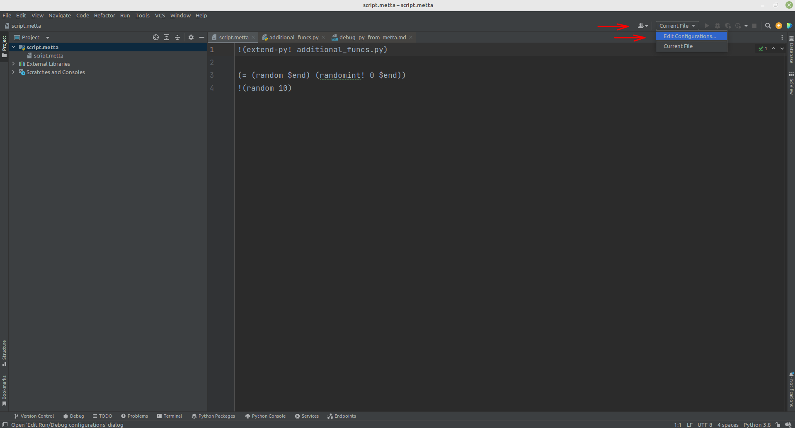
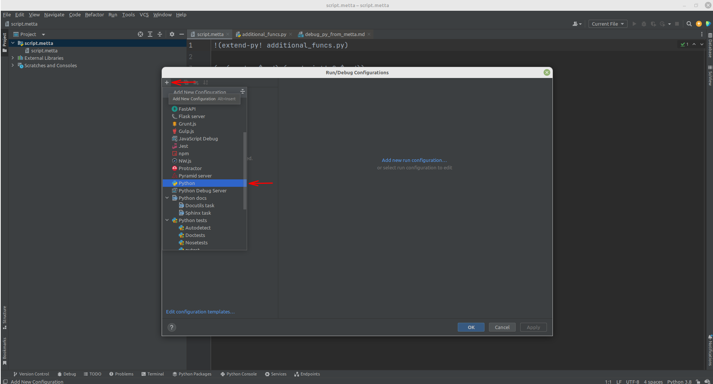
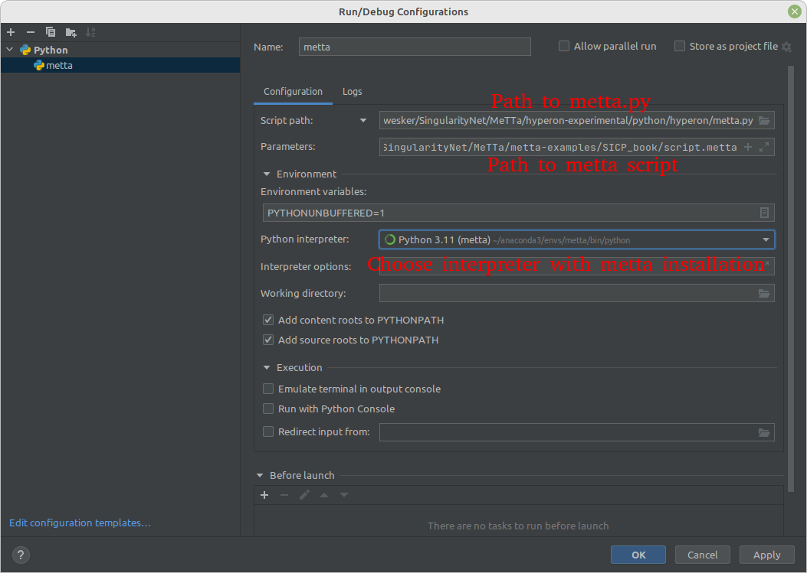
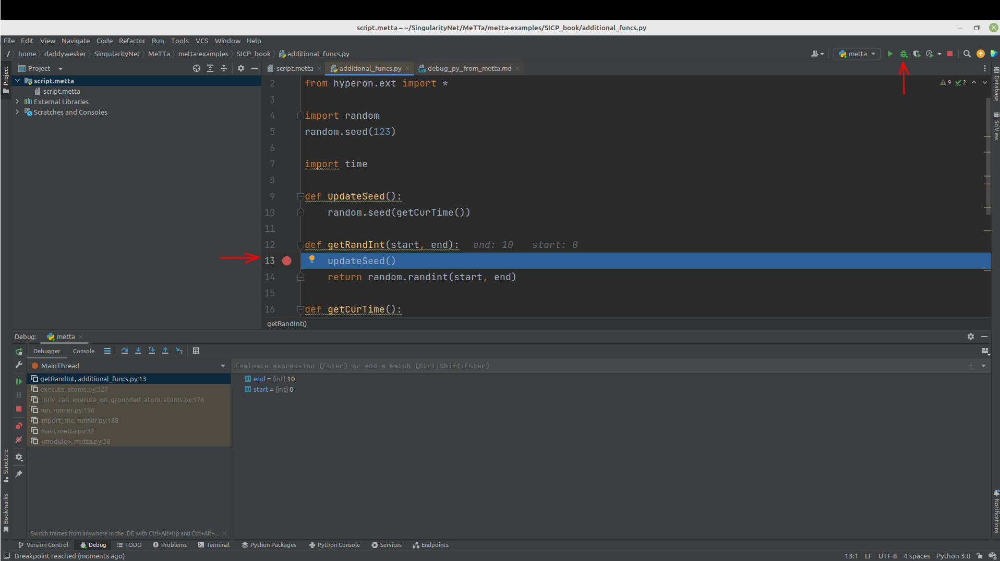

### Debugging python script called from Metta using Pycharm

(In this tutorial Pycharm version 2022.2.1 was used. If you have another Pycharm version there could be some differences, but main idea is the same. Just different placement)

Probably someone like me really like to debug using GUI like Pycharm, so this guide will show you how to debug python
scripts that was launched from Metta script using Pycharm (so you'll need to download it, Community Edition will do).
Let's look at a simple task of using python script to concatenate two string. Probably this is not the best example
but i guess it will do. So we have python script:

    from hyperon.atoms import OperationAtom, ValueAtom
    from hyperon.ext import *
    
    def strAppend(str1, str2):
        print(str1 + " " + str2)
    
    @register_atoms
    def my_glob_atoms():
        return {
            'concatstr!': OperationAtom("concatstr!", strAppend, unwrap=False),
            }

And we want to call *concatstr!* from metta script:

    !(import! &self additional_funcs) ; additional_funcs is our python script's name
    
    !(concatstr! "Hello" "World")

So now we will try to run it using command *metta script.metta* and get following output:

    []
    [(Error (concatstr! "Hello" "World") Exception caught:
    TypeError: unsupported operand type(s) for +: 'GroundedAtom' and 'str'
    
    At:
      /home/daddywesker/SingularityNet/MeTTa/metta-examples/SICP_book/./additional_funcs.py(5): strAppend
      /home/daddywesker/SingularityNet/MeTTa/hyperon-experimental/python/hyperon/atoms.py(320): execute
      /home/daddywesker/SingularityNet/MeTTa/hyperon-experimental/python/hyperon/atoms.py(167): _priv_call_execute_on_grounded_atom
      /home/daddywesker/SingularityNet/MeTTa/hyperon-experimental/python/hyperon/runner.py(188): run
      /home/daddywesker/SingularityNet/MeTTa/hyperon-experimental/python/hyperon/runner.py(180): import_file
      /home/daddywesker/SingularityNet/MeTTa/hyperon-experimental/python/hyperon/metta.py(32): main
      /home/daddywesker/anaconda3/envs/metta/bin/metta(8): <module>
    )]

Okay, probably people deeply familiar with Metta will crack this nut easily just looking at the code, but let's pretend 
we can't do it and we desperately want to debug what is going on inside python script (at least that's what we've 
encountered with Oleg while working at his das wrapper). And we don't quite like debugging using terminal because we 
want to see what is inside variables not using print or just check their types. Pycharm provides an opportunity to 
attach debugger to a process. So that's what we need to do. First, let's add couple of lines to our python script:

    from hyperon.atoms import OperationAtom, ValueAtom
    from hyperon.ext import *
    
    import time
    
    def strAppend(str1, str2):
        time.sleep(10)
        print(str1 + " " + str2)
    
    @register_atoms
    def my_glob_atoms():
        return {
            'concatstr!': OperationAtom("concatstr!", strAppend, unwrap=False),
            }

Why do we need them? Problem is that we can attach to a working process. But such simple script works too fast for us
to be able to attach to it. So we will add *sleep(10)* so we will get *10* seconds to attach to process (of course if 
it is not enough in your case you can put a higher number). Okay, now when we launch our *metta script.metta* command
we need to attach to a process. In pycharm there is a key combination *ctrl+alt+5* though it won't work in older 
versions of gui. In that case you need to click *Run* button on the top of your gui and then choose *Attach to Process*.
Then you'll see window with current system processes. Here you need to choose metta process like on picture:

Here we need process *metta script.metta*, this is exactly what we launched in terminal. After that you'll see this line 
in GUI's debugger console:

That means that everything is fine. If attach process takes long enough and nothing happens you need to check your gui
version. It is possible if your gui is outdated enough for it to have no idea about new versions of python (for example,
what we've faced is Pycharm 2018 can't debug python 3.10 since python 3.10 was made in 2021). Let's move forward. Thanks
to *sleep(10)* line we are able to debug our function. What we see is:

Instead of string we are trying to concatenate two grounded atoms and string *" "*. Of course it doesn't work. But why 
we are receiving grounded atom instead of string? We can use our debugger to step through current thread to previous 
functions calls:

And here we can see that *unwrap=False* somehow affects our args. So my guess was to use unwrap=True and it worked. 
Another way if we want to leave *unwrap=False* we can use a possibility to evaluate python exrpession during debug 
while being attached to the process in a special window (see below pic). Here we can try to wrap str1 variable using 
*str()* and see it doesn't help since it adds new *''* wraps. But it does help to use *str1.get_object().content* 
(this solution was advised by Alexey Potapov). 

This concludes debug tutorial of python scripts which are called inside metta using Pycharm GUI. Of course it won't 
help you to debug metta files themselves but will totally help you to check if everything is fine on the python side. 
_______________________________________________________

### Alternative way

One can also use Pycharm in a different way for this task. Pycharm provides a way to create run/debug configuration 
in which we can provide path to script metta.py from hyperon-experimental repo and provide script to metta script as
an argument. Steps to debug this way are show below on pics (please be careful since in newer releases of metta import
should be done like this: !(import! &self additional_funcs). Variant from the pic is outdated).

After opening Pycharm we first need to create run/debug configuration. Click *Current file* in right top corner of 
Pycharm window and then *Edit configurations*. 

After clicking *Edit configurations* new window will appear named *Run/Debug Configurations*. Here we need to click on 
*+* sign, scroll down and click *Python*. Also we could click *Add new configuration* and same list of configurations 
will appear. 

In the next window we need to put path to metta.py to the *Script path* field and path to metta script we want to run to
the *Parameters* field. Also we need to choose *Python interpreter* in the corresponding field. Interpreter should 
contain installed Metta. 

And after clicking *Ok* in the previous step, we can click *Debug* button in the right top corner of the Pycharm. Of 
course we need to set breakpoint in the right place.
